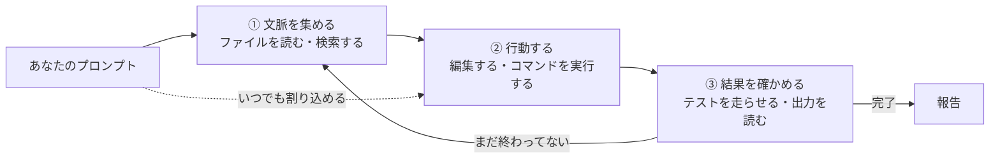

この記事は「Claude Code 101を日本語で」シリーズの第1回です。

Anthropic（アンソロピック／Claudeの開発元）が無料で公開している学習コース「Claude Code 101」を、一から順番に受講しながら、学んだことを日本語でまとめていきます。コースは英語だけなので、「英語のコースはちょっと……」という人の入口になれば、という趣旨です。

:::message
コースの中身をそのまま翻訳する記事ではありません。コースと公式ドキュメントで学んだことを、自分の言葉と自分の手元での実験で組み直しています。正確な一次情報は[公式ドキュメント](https://code.claude.com/docs/en/overview)と[コース本体](https://anthropic.skilljar.com/claude-code-101)をあたってください。
:::


第1回は「Claude Codeとは何か」。仕組みとインストール、最初のプロンプトまでをやります

## このシリーズの進め方

コースは5つのセクションに分かれています。

| 回 | コースのセクション | 内容 |
| --- | --- | --- |
| #1（この記事） | What is Claude Code? / Installing | Claude Codeとは何か、仕組み、インストール、最初のプロンプト |
| #2 | Daily Workflows | 探索→計画→実装→コミットの流れ、コンテキスト管理、コードレビュー |
| #3 | Customizing（前半） | CLAUDE.md とサブエージェント |
| #4 | Customizing（後半） | スキル、MCP、フック |
| #5 | Quiz | 修了クイズと、シリーズ全体の振り返り |


出典: Anthropic Academy の[コース紹介ページ](https://anthropic.skilljar.com/claude-code-101)に載っているカリキュラム一覧。レッスン数はセクションごとに2・2・3・5（修了クイズはこの一覧には出ていない）

受講にはSkilljar（スキルジャー／Anthropicが使っている学習サイト）のアカウント登録が必要ですが、コース自体は無料で、修了すると証明書がもらえます。

一方で、Claude Code本体を動かすには **有料プラン（Pro以上）か API（エーピーアイ／プログラムからClaudeを呼ぶ窓口）の利用料** が必要です。無料プランのClaudeアカウントではClaude Codeは使えません。ここは最初に知っておくべきポイントです。

## Claude Codeとは何か

一言で言うと、**「コードを読んで、書き換えて、コマンドを実行してくれるAIエージェント」** です。

チャット版のClaudeとの違いは、「答えを返す」で終わらないところです。Claude Codeは自分でファイルを開き、検索し、編集し、テストを走らせて、結果を見てまた直します。つまり、こちらが「やっておいて」と頼んだ仕事を、実際に手を動かして片付けてくれる存在です。

動く場所は4つあります。

- **ターミナル**（コマンドラインの黒い画面）：フル機能。この記事の主役
- **IDE（統合開発環境）拡張**（VS Code、JetBrains）：エディタの中で差分を見ながら使える
- **デスクトップアプリ**：複数セッションを並べたり、定期実行を組んだりできる
- **Web**（claude.ai/code）：手元にセットアップ不要。長いタスクを投げて放置できる

どこから使っても中身のエンジンは同じで、後述する CLAUDE.md や設定はそのまま共有されます。

### どれを使えばいい？

コースの中で「結局どれ？」への答えがはっきり書かれていたので、自分なりにまとめるとこうです。

| 使い方 | 向いている人 |
| --- | --- |
| ターミナル | 新機能が一番早く来る。最先端を追いたいならここ |
| IDE拡張 | エディタと一体で使いたい。中身はターミナル版とほぼ同じ |
| デスクトップ | 裏でClaudeに作業させつつ、自分は別のことをしたい |
| Web | 手元にリポジトリがない、GitHub上のプロジェクトを遠隔で触りたい（GitHubリポジトリ限定） |


IDE拡張はVS CodeとJetBrainsの2種類。分けて数えれば5つの入口があるが、エンジンは全部同じ

自分はデスクトップアプリを普段使いにしていますが、この記事のシリーズではターミナル版を基準に書きます。

### そもそも「エージェント」とは

コースでは、Claude Codeとチャット版Claudeの違いを「エージェントかどうか」で切っていました。

エージェントとは、**環境とやり取りしながら、決められたゴールに向けて行動するソフトウェア** のこと。中身は「大規模言語モデルをリアルタイムでループの中で回している」だけなんですが、そこにツール、外部サービス、さらには別のエージェントを繋げることで、自分で手を動かして仕事を進められるようになります。

コピペで往復する代わりに、Claudeが自分でファイルの中に入っていって作業する。これがエージェントとしてのClaude Codeです。


「答えを返す」で終わるか、「自分で手を動かす」まで行くか。ここが境目

### 使う前に押さえる3つのこと

コースが最初に強調していた3点。地味ですが、この後の全部の土台になります。

1. **コンテキストウィンドウ**（Claudeの作業記憶）には上限がある。だからClaude Codeはコードベース全部を読み込むのではなく、必要な場所を「探して」読む。この探し方こそがエージェント的な部分
2. **既定では許可を求めてくる**。ファイル編集もコマンド実行も、こちらが承認してから動く。手綱はこちらが握っている
3. **間違える**。意図を取り違える、バグを入れる、過剰に作り込む、どれも起きる。だから「ループの中に自分がいる」状態を保つのが大事

3つ目をコースがわざわざ書いているのが良いなと思いました。万能ツールとして売っていない。


上限がある・許可を求める・間違える。この3つを前提に付き合う

## 仕組み：エージェントループ

ここがこの回で一番大事な話です。

Claude Codeに仕事を頼むと、内部では次の3つのフェーズをぐるぐる回しています。




③で「まだ」なら①に戻り、「完了」なら報告。途中でこちらが割り込むこともできる

1. **文脈を集める（gather context）**：関係するファイルを探して読む
2. **行動する（take action）**：ファイルを編集したり、コマンドを実行したりする
3. **結果を確かめる（verify results）**：テストを回す、出力を読む、必要なら①に戻る

このループを「エージェントループ（agentic loop）」と呼びます。

たとえば「失敗しているテストを直して」と頼むと、こんな動きになります。

1. テストを実行して、何が落ちているか見る
2. エラー出力を読む
3. 関係しそうなソースファイルを検索する
4. そのファイルを読んで、コードの意図を理解する
5. 修正する
6. もう一度テストを走らせて、直ったか確認する

各ステップで得た情報が次のステップの判断材料になる。これが「エージェント」たる所以です。

### モデルとツール、そして「ハーネス」

ループを支えているのは2つの部品です。

- **モデル**：考える側。Claude本体。Sonnet（そんねっと）が普段使い、Opus（おーぱす）が難しい設計判断向け。セッション中に `/model` で切り替えられます
- **ツール**：動く側。ツールがなければモデルは文章を返すことしかできません

公式ドキュメントでは、Claude Codeのことを「Claudeの周りにある **エージェントハーネス（agentic harness）**」と表現しています。ハーネスは「馬具」や「安全帯」の意味で、要するに「言語モデルという頭脳に、道具と作業環境と安全装置を装着して、実際に働けるようにする枠組み」のことです。モデルそのものではなく、その外側の仕掛けがClaude Codeなんですね。

### 組み込みツールの5分類

| 分類 | できること |
| --- | --- |
| ファイル操作 | 読む、編集する、新規作成する、リネームする |
| 検索 | パターンでファイルを探す、正規表現で中身を検索する |
| 実行 | シェルコマンド、サーバー起動、テスト、git |
| Web | 検索、ドキュメント取得、エラーメッセージの調査 |
| コード理解 | 編集後の型エラー確認、定義ジャンプ（プラグインが必要） |


モデルが「考える側」なら、ツールは「動く側」。この5分類が手足になる

ほかに「サブエージェント（子エージェント）を起動する」「ユーザーに質問する」といった調整用のツールもあります。サブエージェントは第3回で扱います。

### Claude Codeが見ているもの

プロジェクトのディレクトリで `claude` を起動すると、次のものにアクセスできるようになります。

- そのディレクトリ以下のファイル（それ以外は許可制）
- ターミナルで自分が打てるコマンド全部
- gitの状態（ブランチ、未コミットの変更、履歴）
- `CLAUDE.md`（プロジェクトのルールを書いておくファイル。第3回で詳しく）
- 自動メモリ（作業中に学んだ好みなどを勝手に保存してくれる仕組み）
- 自分で追加したMCP（エムシーピー／外部ツールをClaudeに繋ぐ共通規格）のサーバーやスキル（第4回）

「プロジェクト全体が見えている」ので、複数ファイルにまたがる修正ができます。一つのファイルしか見ていない補完型のAIとの一番の違いはここです。

## インストールと最初のプロンプト

### インストール

macOS / Linux / WSL（Windows上のLinux環境）はこれ一発です。

```bash
curl -fsSL https://claude.ai/install.sh | bash
```

Homebrew（macOSのパッケージ管理ツール）派なら次でもOK（こちらは自動更新されないので、たまに `brew upgrade claude-code`）。

```bash
brew install --cask claude-code
```

確認はこれ。バージョン番号の後ろに `(Claude Code)` と出れば成功です。

```bash
claude --version
```

### ログインと起動

プロジェクトのディレクトリに入って `claude` と打つだけ。初回はブラウザでログインを求められます。

```bash
cd your-project
claude
```

`ANTHROPIC_API_KEY` という環境変数を設定してあると、ログイン画面を飛ばしてAPIキーの承認になります。アカウントを切り替えたいときはセッション内で `/login` です。

### 最初のプロンプト

コースでも公式クイックスタートでも、最初に勧められるのは「コードを書かせる」ではなく **「プロジェクトについて聞く」** です。

```text
what does this project do?
```

日本語でも普通に通じます。

```text
このプロジェクトは何をしている？
エントリーポイントはどこ？
フォルダ構成を説明して
```

ここでClaude Codeは勝手にファイルを読んで回答します。こちらが「このファイルを見て」と指定する必要はありません。上のエージェントループの①が動いているわけです。


インストール→バージョン確認→起動→最初のプロンプト、を1画面にまとめるとこう。バージョン表示は手元の実物（2.1.272）

次に、軽い変更を頼んでみます。

```text
メインファイルに hello world 関数を追加して
```

変更前に確認を求められたら `Yes` で承認します。

### 複数ステップの仕事は Planモードから

コースの「最初のプロンプト」レッスンで一番推されていたのが Planモードでした。

`Shift+Tab` を何回か押して Planモードに入ると、Claude Codeは **読み取り専用のツールだけ** でコードベースを調べ、途中で確認の質問をしてきて、最後に実行計画を返してきます。計画を読んで良さそうなら承認、そこから初めてファイルに手が入ります。


承認するまでソースは触られない。「計画を読む」がこちらの仕事になる

コースで出ていた例は「アプリ全体にダークモードを入れたい」というもの。ヘッダーに切り替えスイッチを置いて、既存のライトテーマに合うコントラストの色を選んで、という複数ファイルにまたがる仕事です。こういう「一発で終わらない依頼」ほど、いきなり書かせるより先に計画を出させたほうが事故が減ります。

プロンプトのコツとしてコースが言っていたのは一つだけ、**できるだけ具体的に書く**。「バグ直して」ではなく「ログインで間違ったパスワードを入れた後に画面が真っ白になるバグを直して」。これはClaude Codeに限らず、人に頼むときと同じですね。

### 覚えておくべき操作

| 操作 | 意味 |
| --- | --- |
| `claude "タスク"` | 最初のプロンプト付きで起動 |
| `claude -p "質問"` | 1回だけ答えて終了（スクリプトから使える） |
| `claude -c` | 直前の会話を続ける |
| `claude -r` | 過去の会話を選んで再開 |
| `/help` | コマンド一覧 |
| `/clear` | 会話履歴をクリア |
| `/context` | 今コンテキストを何が食っているか見る |
| `Shift+Tab` | 権限モードの切り替え |
| `Esc` | 今の動作を止める |
| `Esc` 2回 | ファイルの変更を巻き戻す |

## 安全装置：チェックポイントと権限モード

「勝手にファイルを書き換えるって怖くない？」という不安に対する答えが、この2つです。

**チェックポイント**：Claude Codeはファイルを編集する前に、必ず元の中身をスナップショットしています。おかしくなったら `Esc` を2回押すか、「さっきの変更を戻して」と頼めば戻せます。gitとは別の仕組みなので、コミットしていなくても戻せます。ただし対象はファイルだけで、データベースや外部APIへの操作は戻せません。


編集のたびにスナップショットが残るので、おかしくなった時点から巻き戻せる

**権限モード**：`Shift+Tab` で切り替えます。

| モード | 挙動 |
| --- | --- |
| Auto | 分類器がバックグラウンドで危険な操作だけ止める。Pro/Max/Teamプランでは既定 |
| Manual | ファイル編集とコマンド実行の前に毎回聞いてくる |
| Accept edits | ファイル編集は聞かずにやる。それ以外のコマンドは聞く |
| Plan | 探索と計画だけ。ソースは触らない |

ちなみにコースのレッスン本文では「既定（毎回聞く）／Auto-accept（編集は自動、コマンドは聞く）／Plan」の3つだけが説明されていて、Autoモードは出てきません。公式ドキュメントのほうが先に進んでいる形です。学習コースと製品の進化速度がズレるのはこの分野あるあるなので、**迷ったらドキュメントを正とする** のが安全です。


コースの3つと公式ドキュメントの4つを並べると、Autoだけが新顔だと分かる

最初は Manual か Plan で「何をしようとしているか」を眺めるのがおすすめです。慣れてきたら Auto に上げていく。筋トレの重量と同じで、いきなりMAXは危ないです。

## やってみた記録

環境：macOS、Claude Code 2.1.272、ターミナル。対象は自分が普段触っている、複数のアプリとサーバーからなる中規模のリポジトリ（中身は本題ではないので伏せます）。

### 「このプロジェクトでは何をしている？」

起動して日本語で投げました。22秒で、プロジェクトの目的、部品ごとの担当、今の局面、チームの作業ルール、の4段構成で答えが返ってきた。

面白かったのは **何を読んで答えたか**。回答の文面から逆算すると、

- gitの直近コミット（「直近のコミットを見ると…」）
- 自動メモリ（「メモリ上では…提出予定だったから」）
- ディレクトリ構成と、プロジェクト直下の指示書（CLAUDE.md。第3回でやります）

の3点で、ソースコードの中身はほぼ読んでいません。「コードベース全体を読み込まず、戦略的に探す」の実物です。新しいチームに入った人がまずREADMEとgit logと先輩のメモを見るのと同じ動きでした。

続けて `/context` を打って、いま何がコンテキストを使っているかを見ます。

| 項目 | トークン |
| --- | --- |
| System tools（ツールの定義） | 25.5k |
| Messages（会話そのもの） | 8k |
| Memory files（自動メモリ + CLAUDE.md） | 7.6k |
| System prompt | 4.2k |
| Skills（24個の説明文だけ） | 3.3k |
| MCP tools（70個） | 0 |
| 合計 | 48.4k / 1M（5%） |


`/context` の出力。会話を始める前から約40kトークンがツール定義などの固定費で埋まっている

気づいたこと。

- **会話を始める前に約40kトークン使っている**。ハーネスの実体はこの固定費で、ツール定義が一番重い
- **MCPツール70個で0トークン**。「必要になるまで読み込まない」設計で、圧縮を遅らせている
- 窓は1Mトークンなので、今回の使い方では圧縮はまだ遠い。ただし大きなファイルを何個も読ませると Messages が一気に膨れる

### 権限モードは「Auto」が既定だった

画面下に `auto mode on` と出ていました。コースの3モードには無い、公式ドキュメント側の4つ目のモードです。手元の環境は最初からこれ。この記事で「迷ったらドキュメントを正とする」と書いた理由がそのまま画面に出ていた形です。

## 研究者目線のメモ

自分はVRとAIエージェントの研究をしている大学院生なので、ここで一番刺さったのは「Claude Codeはモデルではなくハーネスである」という整理でした。

エージェントの賢さは、モデル単体ではなく「ツール」「コンテキスト管理」「安全装置」の設計で決まる。これはClaude Codeに限らず、マルチエージェントシステムを自分で組むときにもそのまま当てはまります。次回以降、CLAUDE.md・サブエージェント・フックといった「ハーネスの部品」を一つずつ見ていくと、自作エージェントの設計の参考になるはずです。

## 次回

第2回は「Daily Workflows」。探索→計画→実装→コミットという基本の流れと、コンテキストが溢れたときに何が起きるか、コードレビューの頼み方をやります。

## 参考

- [Claude Code 101（Anthropic Academy）](https://anthropic.skilljar.com/claude-code-101)
- [Overview - Claude Code Docs](https://code.claude.com/docs/en/overview)
- [Quickstart - Claude Code Docs](https://code.claude.com/docs/en/quickstart)
- [How Claude Code works - Claude Code Docs](https://code.claude.com/docs/en/how-claude-code-works)
