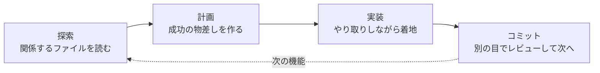

この記事は「Claude Code 101を日本語で」シリーズの第2回です。

Anthropic（アンソロピック／Claudeの開発元）の無料コース「Claude Code 101」を一から受講しながら、学んだことを日本語でまとめています。今回はセクション3「Daily Workflows（日常のワークフロー）」。コースが「一つだけ持ち帰るならこれ」と言い切っている回です。

:::message
コースの中身をそのまま翻訳する記事ではありません。コースと公式ドキュメントで学んだことを、自分の言葉と自分の手元での実験で組み直しています。一次情報は[公式ドキュメント](https://code.claude.com/docs/en/overview)と[コース本体](https://anthropic.skilljar.com/claude-code-101)をあたってください。
:::


第2回は「日常のワークフロー」。探索→計画→実装→コミットの型と、コンテキストの扱い方をやります

## 前回のおさらい

第1回では、Claude Codeが「モデル（考える側）」と「ハーネス（ツール・コンテキスト管理・権限という手足）」でできていて、プロンプト→文脈を集める→行動する→確かめる、というエージェントループで動くことを見ました。今回はそのループを **人間側がどう使いこなすか** の話です。

## 探索→計画→実装→コミット

コースの言い分はシンプルで、「多くの人は最初から『コード書いて』と頼むから、後で軌道修正が増える」。サッカーで言えば、ボールを受けた瞬間にシュートを打つな、まず顔を上げろ、です。




4ステップを1周して、次の機能でまた探索から。軌道修正するなら計画の段階が一番安い

### 探索と計画は Planモードでまとめてやる

`Shift+Tab` を押して画面下に「Plan Mode」と出る状態にすると、Claudeは **ファイルを編集できなくなり、読むだけ** になります。この状態で、たとえば「画像アップロードの処理にWebP変換を足したい。どこでやるべきか、新しい依存が要るか、どう進めるか考えて」と投げると、関係ファイルを読み、必要ならWeb検索もして、行動計画を返してきます。


Shift+Tabを押すたびに画面下の表示が切り替わる。表示文言は公式ドキュメントに合わせた再現画像で、順番とautoの有無は環境やプランで変わる

気に入らなければ「この部分だけ直して」と言えばいい。**コードが1行も書かれていないので、ここで方向転換しても失うものがゼロ** です。コースはここを「軌道修正が一番安い場所」と呼んでいました。


承認するまでコードは1行も書かれない。計画を読んで直す、がこちらの仕事

変更するつもりがなく、コードベースの概要だけ知りたいときは、Planモードに入らずに「探索サブエージェント」を走らせる手もあります（サブエージェントは第3回で詳しくやります）。

### 実装をなめらかにする3つのコツ

計画に納得したら承認して、Claudeに項目を消化させます。この段階のコツとしてコースが挙げていたのは3つ。

1. **成功の条件を決める**。「正しい」が何かを明示しないと、Claudeは自信を持って「終わった」と言えない。計画を書く段階で入れる
2. **ツールを足す**。WebのUIを作るなら Claude in Chrome を入れて、ブラウザで直接テストさせる。往復が減る
3. **テストを用意する**。Claudeにテストを書かせてもいい。ただし渡す前に **そのテストが本当に正しいか（偽陽性がないか）** を確認する


成功の条件・ツール・テストの3点セット。テストは渡す前に自分の目で見る

小技として「同じ問題に何度もハマるなら、解決策をCLAUDE.mdに保存させる」。これは次回の伏線です。


成功の条件を書いたプロンプトで実装させ、テストが通って終わるまでの流れ。出力例は読みやすいよう整形した再現画像で、実際の画面そのものではない

### コミットの前に「別の目」

自分でテストして納得したら、コミット前に **サブエージェントにコードレビューをさせる**。サブエージェントは別のコンテキストで動くので、セッション中にメインのエージェントが持ってしまった思い込みを引きずらない。「新しい目（fresh eyes）」という表現をコースは使っていました。


作った本人は思い込みを引きずる。別のコンテキストで、読み取り専用のレビュアーに見せる

そのあと自分のスタイルでコミットメッセージを書かせて、次の機能へ。これの繰り返しです。

## コンテキスト管理

コンテキストはClaudeの作業記憶で、読んだファイル、実行したコマンド、送ったメッセージ、ツールの結果、すべてがここに積まれていきます。有限なので、使い方の良し悪しがそのまま精度とコストに跳ね返ります。

### 溢れたらどうなるか

上限に近づくと自動で **圧縮（compaction）** が走ります。重要な部分は要約し、不要なツール結果は消す。ここで細部が失われることがある、とコースは明言しています。第1回の `/context` で「圧縮はまだ遠い」と書きましたが、遠いだけで、来れば必ずこうなります。


読んだファイルやコマンド結果が積み上がって上限に近づくと、要約に置き換わる。細部はここで落ちる

### 3つのコマンド

| コマンド | 何をする | いつ使う |
| --- | --- | --- |
| `/compact` | ここまでを手動で圧縮。記憶は要約として残す | 同じ機能を作っていて上限が近い。続けたい |
| `/clear` | 全部消す。記憶ゼロから | 新しい機能に移る。前の会話のバイアスを持ち込みたくない |
| `/context` | 何がどれだけ食っているかを見る | いつでも。まず現状を見る |


/context で内訳を見て、続けるなら /compact、切り替えるなら /clear。実行結果をもとに、読みやすいよう一部整形した再現画像

「セッションをまたいで覚えていてほしいこと」は `/compact` で残そうとせず、CLAUDE.mdに書く。そうすればClaudeが毎回ゼロから発見し直さなくて済みます。


迷ったら /context で現状を見る。またいで残したい記憶は CLAUDE.md へ

### 節約のコツ3つ

1. **具体的に書く**。曖昧なプロンプトは短く見えて、Claudeが自力で探索と推論をする分、結果的にコンテキストを多く使う。長い指示のほうが安い、という逆説
2. **MCP（エムシーピー／外部ツールをClaudeに繋ぐ共通規格）のサーバーを整理する**。コースの説明では「MCPサーバーは既定で全ツールを読み込む」ので、今のプロジェクトに関係ないサーバーは切る。スキルは必要時にしか中身を読まないので軽い
3. **サブエージェントに任せる**。別のコンテキストで動いて、要約だけ返す。「認証エンドポイントはどこ？」のように答えだけ欲しい仕事に向く

2番については、自分の環境で `/context` を見ると事情が少し違いました。後述の「やってみた記録」で触れます。


具体的に書く・MCPを整理する・サブエージェントに任せる。2番は今の製品では切迫度が下がっている

## コードレビューとgitまわり

コースの7本目は短く、gitの摩擦を減らす3つの機能の紹介でした。

- **レビュー用サブエージェント**。作るときは **読み取り専用ツールに制限** する。レビュアーは指摘する係で、直す係ではない。設定ファイルをリポジトリに入れておけば、チーム全員が同じレビュアーを使える
- **`/commit-push-pr`**。コミット、プッシュ、PR（プルリクエスト／変更をレビューしてもらう依頼）の作成を1コマンドで。SlackのMCPサーバーを繋いでCLAUDE.mdにチャンネルを書いておくと、PRのリンクを自動投稿してくれる
- **`claude --from-pr <PR番号>`**。ClaudeがPRを作ると、そのセッションがPRに紐づく。後でレビュー対応やCI失敗の修正に戻るとき、この番号で再開できる


レビュアーに見せる→ /commit-push-pr → PR番号で再開、の一連の流れ。出力例は読みやすいよう整形した再現画像で、実際の画面そのものではない

## やってみた記録

環境：macOS、Claude Code 2.1.272、ターミナル。対象はこのZenn記事のリポジトリ（`articles/` と `images/` があるだけの、コードをほとんど含まないリポジトリ）。

### Planモードで「探索→計画」を投げてみた

題材は実際に困っていたことにしました。Zennは画像1枚3MBまでしか受け付けず、超えるとリポジトリ全体のデプロイが止まります。この記事シリーズで画像を増やすので、公開前に機械的にチェックしたい。

`Shift+Tab` でPlanモードにして、成功の条件を1行足したプロンプトを投げました。

```text
articles/ 配下の記事が参照している images/ の画像に3MBを超えるものがないかチェックするスクリプトを追加したい。
成功の条件: npm run check-images で超過ファイルのパスとサイズが1行ずつ出て、超過ゼロなら終了コード0。
どこに置くか、新しい依存が要るか、どう進めるかの計画だけ出して。
```

返ってきた計画の要点を、自分の言葉でまとめます（計画の全文は `~/.claude/plans/` 配下にMarkdownで保存されていました）。

**探索で分かったこと（読むだけで調べた）**

- リポジトリに `package.json` が無い。Node v24 が入っている。だから **標準モジュールだけで書けて、新しい依存はゼロ**
- 記事内の画像参照は2パターンだけ。`/images/...` 形式が451件、GitHubのraw URL形式が144件（計画を出した時点の数。この後さらに記事を書き足したので、実行時は605件になっています）。HTMLの `` は無い
- いまの最大画像は2.88MBで、上限すれすれ

**設計**

- 新規ファイルは2つ。`package.json`（scriptsだけ）と `scripts/check-images.mjs`
- 参照先の画像が存在しない場合は **警告だけで終了コードに影響させない**。成功条件が「超過ゼロなら0」なので、欠損は別問題として扱う
- 同じ画像を複数記事が参照していても1回だけ判定

**検証手順（Claudeが自分で書いた）**

- しきい値を一時的に2MBに下げて実行し、超過が1行ずつ出て終了コードが1になることを確認してから戻す
- `grep` で数えた参照数と「checked N images」の件数がおおむね一致することを確認

**やらないこと**

- 画像の自動圧縮、孤立画像の検出、CIへの組み込み

ここまでで、コードは1行も書かれていません。それでも「依存ゼロで済む」「欠損は警告止まり」「検証は閾値を下げて偽陰性を潰す」まで決まっている。この記事の前半で学んだ「成功の条件を決める」「テストが本当に正しいか確認する」を、こちらが1行書いただけで計画側が展開してくれた形です。

計画の最後に出てきた選択肢は3つ。「自動モードで実行」「編集を毎回承認しながら実行」「計画を直す」。ここで承認するかどうかを、コードを見る前に決められる。コースの「軌道修正が一番安い場所」というのは、この画面のことでした。


プロンプト→探索→計画→承認の選択肢まで。コードを見る前に「直す」を選べる。実行結果をもとに、読みやすいよう一部整形した再現画像

### 承認して、実装させて、検証する

計画を承認して実装させました。できたのはこの2ファイルです。

```json:package.json
{
  "private": true,
  "scripts": {
    "check-images": "node scripts/check-images.mjs"
  }
}
```

```js:scripts/check-images.mjs
// articles/ 配下の記事が参照している images/ の画像に 3MB 超がないか確認する。
// 使い方: npm run check-images
// 終了コード: 超過 0 件 → 0 / 1 件以上 → 1（参照先が無い画像は警告のみ）
import { readdirSync, readFileSync, statSync, existsSync } from "node:fs";
import { join, resolve, dirname } from "node:path";
import { fileURLToPath } from "node:url";

const REPO = resolve(dirname(fileURLToPath(import.meta.url)), "..");
const LIMIT_BYTES = 3 * 1024 * 1024;
const RAW_PREFIX = /^https:\/\/raw\.githubusercontent\.com\/Appare7\/zenn-content\/[^/]+\/images\//;

const articlesDir = join(REPO, "articles");
const refs = new Map(); // 画像の絶対パス → 最初に参照した記事

for (const name of readdirSync(articlesDir).filter((f) => f.endsWith(".md"))) {
  const md = readFileSync(join(articlesDir, name), "utf8");
  for (const m of md.matchAll(/!\[[^\]]*\]\(([^)]+)\)/g)) {
    let target = m[1].trim().split(/\s+/)[0]; // "=300x" などの幅指定を捨てる
    if (target.startsWith("/images/")) target = join(REPO, target);
    else if (RAW_PREFIX.test(target)) target = join(REPO, "images", target.replace(RAW_PREFIX, ""));
    else continue; // それ以外の外部 URL は対象外
    if (!refs.has(target)) refs.set(target, name);
  }
}

let over = 0;
for (const [file, article] of refs) {
  if (!existsSync(file)) {
    console.error(`missing: articles/${article} -> ${file.replace(REPO, "")}`);
    continue;
  }
  const bytes = statSync(file).size;
  if (bytes > LIMIT_BYTES) {
    over++;
    console.log(`${file.replace(REPO + "/", "")}  ${(bytes / 1024 / 1024).toFixed(2)} MB (${bytes} bytes)`);
  }
}
console.error(`checked ${refs.size} images, ${over} over limit`);
process.exit(over > 0 ? 1 : 0);
```

実行します。

```bash
npm run check-images; echo "exit=$?"
```

```text
missing: articles/claude-code-101-03-claude-md-subagents.md -> /images/claude-code-101-03-claude-md-subagents/figure5.png
missing: articles/deeplearning-13.md -> /images/deeplearning-13/figure2.png
（略）
checked 605 images, 0 over limit
exit=0
```

超過はゼロで終了コード0。同時に「参照先の画像が無い」警告が出ました。書きかけの記事が参照している、まだ生成していない画像です。計画どおり **警告は出すが終了コードには影響させない** ので、公開前チェックとしてはこの挙動が正しい。

次に、計画に書いてあった検証。しきい値を一時的に2MBに下げて走らせます。

```text
images/ai-news-20260701-krea2/source2.png  2.12 MB (2219158 bytes)
images/claude-code-101-01-what-is-claude-code/figure1.png  2.37 MB (2484524 bytes)
（略）
checked 605 images, 121 over limit
exit=1
```

超過が1行ずつ出て、終了コードが1になる。「超過ゼロなら0」の裏側、「超過があれば非0」も確かめられました。`grep` で数えた画像参照は605件で、同じ画像を複数の記事から参照している箇所が無いこのリポジトリでは `checked 605 images` とそのまま一致しました。

ここまでが「探索→計画→実装→コミット」の「実装」まで。コースの言う「成功の条件を決める」「テストが本当に正しいか確かめる」を、計画の段階で決めておいたおかげで、実装後の確認は計画に書いてある手順をなぞるだけでした。


### /context で見えた「コースと製品のズレ」

前回の `/context` の結果を見返すと、MCPサーバーの行はこうでした。

```text
MCP tools · /mcp (loaded on-demand)
└ 70 tools · 0 tokens
```


70個のツールが 0 トークン。実行結果をもとに、読みやすいよう一部整形した再現画像

コースは「MCPサーバーは既定で全ツールを読み込む」と説明していますが、手元の環境では70個のツールが **0トークン**。必要になったときに読み込む方式に変わっています。コースの「MCPを整理しろ」という助言自体は今も正しい（サーバーの説明文などは残る）ものの、切迫度はだいぶ下がっている。前回に続いて「迷ったらドキュメントを正とする」案件です。

## 研究者目線のメモ

今回いちばん刺さったのは「新しい目」の考え方です。長いセッションのエージェントは自分の判断に引っ張られる。だからレビューは別のコンテキストで、しかも読み取り専用でやらせる。

これはマルチエージェントの設計そのものです。役割を分けるだけでなく、**コンテキストを分けることでバイアスを断つ**。自分が研究で扱うAIエージェントの評価でも、「作った本人に評価させない」は基本ですが、それをエージェント同士でやる発想は使えそうです。

もう一つ、コンテキストは「共有メモリ」ではない、という点。サブエージェントに渡るのは要約だけで、生のやり取りは渡らない。複数エージェントで何かを組むとき、何をどこまで共有するかは設計者が決めないといけない。次回のCLAUDE.mdとサブエージェントは、まさにその話になります。

## 次回

第3回は「The CLAUDE.md file」と「Subagents」。消えない指示の置き場所と、別のコンテキストで働く分身の作り方です。

## 参考

- [Claude Code 101（Anthropic Academy）](https://anthropic.skilljar.com/claude-code-101)
- [Common workflows - Claude Code Docs](https://code.claude.com/docs/en/common-workflows)
- [How Claude Code works - Claude Code Docs](https://code.claude.com/docs/en/how-claude-code-works)
- [Manage sessions - Claude Code Docs](https://code.claude.com/docs/en/sessions)
