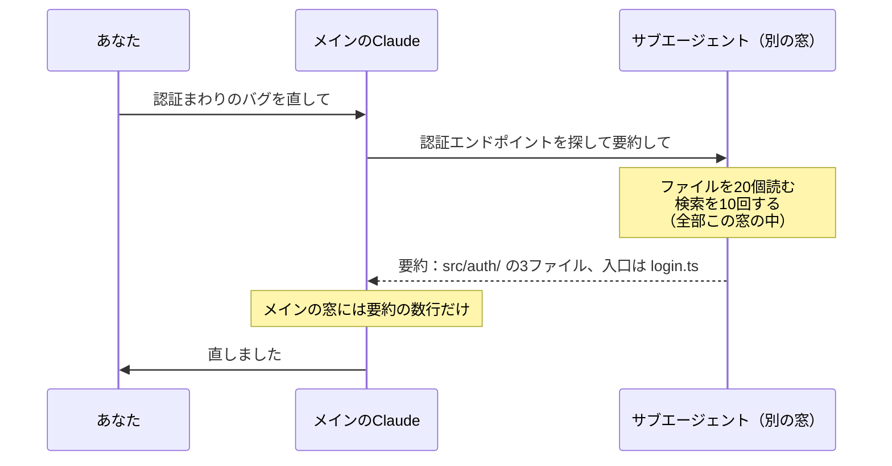

この記事は「Claude Code 101を日本語で」シリーズの第3回です。

Anthropic（アンソロピック／Claudeの開発元）の無料コース「Claude Code 101」を一から受講しながら、学んだことを日本語でまとめています。今回はセクション4「Customizing Claude Code」の前半、CLAUDE.md とサブエージェント。第2回で触れた「セッションをまたいで残したい記憶はCLAUDE.mdへ」と「新しい目」の正体です。

:::message
コースの中身をそのまま翻訳する記事ではありません。コースと公式ドキュメントで学んだことを、自分の言葉と自分の手元での実験で組み直しています。一次情報は[公式ドキュメント](https://code.claude.com/docs/en/memory)と[コース本体](https://anthropic.skilljar.com/claude-code-101)をあたってください。
:::


第3回は CLAUDE.md とサブエージェント。消えない記憶の置き場所と、別の窓で働く分身の作り方をやります

## 前回のおさらい

第2回では、コンテキスト（Claudeの作業記憶）が有限で、溢れると圧縮されて細部が消えること、だから「セッションをまたいで覚えていてほしいこと」は別の場所に置く必要があることを見ました。その置き場所が CLAUDE.md です。そしてコンテキストを汚さずに探索やレビューをする手段が、サブエージェントでした。

## CLAUDE.md：コードベースのオンボーディング資料

### 解決する問題

CLAUDE.md が無いと、Claude Codeは毎回まっさらな状態から始まります。コードベースを探索し直し、依存関係を調べ直し、どの機能が実装済みかを把握し直す。ときには推測で動いて、軌道修正しにくくなる。

CLAUDE.md はプロジェクト直下に置くMarkdownファイルで、セッション開始時に毎回自動で読まれます。コースの言い方を借りると **「コードベースのオンボーディング資料（新人向け説明書）」**。中身はプロンプトの後ろに付け足されます。つまり毎回コンテキストを消費する。だから「コンパクトに」が合言葉になります。


毎朝ゼロから探し直すか、説明書を読んで始めるか。差はここで出る

### 典型的な中身

コースの例を日本語にするとこうなります。

```markdown:CLAUDE.md
# プロジェクト
Next.js 15 のアプリ。App Router、Tailwind、Drizzle ORM を使用。

# コマンド
- 開発サーバー: `pnpm dev`
- テスト: `pnpm test`
- Lint: `pnpm lint`

# コードスタイル
- インデントは2スペース
- 名前付きexportを優先
- APIルートは全部 app/api/ に置く
- 可能なら APIルートではなくサーバーアクションを使う
```

これだけで、「Reactコンポーネント作って」と頼んだときにTailwindで書き、規約を守ります。ポイントは全部 **検証できる具体さ** で書かれていること。「きれいに書いて」ではなく「2スペース」。

### 置き場所は6段ある

コースでは「プロジェクト用」と「ユーザー用」の2つだけ紹介されていましたが、公式ドキュメントを見ると実際は6段あります。読み込まれる順（広い→狭い）に並べます。

| 段 | 場所 | パス | 効く範囲 | 共有 | 読み込み |
| --- | --- | --- | --- | --- | --- |
| 1 | 組織ポリシー | macOS: `/Library/Application Support/ClaudeCode/CLAUDE.md` | そのマシンの全ユーザー・全リポジトリ | IT部門が配布。個人は除外不可 | 起動時 |
| 2 | ユーザー | `~/.claude/CLAUDE.md` | 自分の全プロジェクト | 自分だけ | 起動時 |
| 3 | プロジェクト | `./CLAUDE.md` または `./.claude/CLAUDE.md` | そのリポジトリ | gitでチーム共有 | 起動時 |
| 4 | ローカル | `./CLAUDE.local.md` | そのリポジトリ、自分だけ | `.gitignore` に入れる | 起動時 |
| 5 | サブディレクトリ | `<subdir>/CLAUDE.md` | その配下 | gitで共有 | その配下のファイルを読んだとき |
| 6 | ルール分割 | `.claude/rules/*.md` | `paths:` 指定があればそのファイルだけ | gitで共有 | 無指定は起動時、`paths` ありは該当ファイルを読んだとき |


広い段から順に貼り重ねられる。点線の2段だけ「必要になったら」読まれる

覚え方は3つ。

- **上書きではなく連結**。上の段から順に貼られるので、起動した場所に近いものほど後に読まれる
- **上の階層も拾う**。`foo/bar/` で起動すると `foo/CLAUDE.md` も読まれる
- **サブディレクトリと `paths` 付きルールだけ「必要になったら」**。それ以外は全部起動時

そしてもう一つ、第2回で「圧縮で細部が消える」と書いた話の続き。**プロジェクト直下の CLAUDE.md は `/compact` の後に再読み込みされます**。会話で言っただけの指示は圧縮で消えるが、CLAUDE.md に書いた指示は戻ってくる。「消える記憶と消えない記憶」の境目はここです。


同じ「2スペース」でも、会話で言ったものは /compact で溶け、CLAUDE.md に書いたものは戻ってくる

### コースが挙げていたコツ3つ

1. **修正を記憶させる**。同じ注意を2回したら、「このルールを保存して」と明示的に頼む。次回から知っている
2. **プロジェクト文書を参照させる**。`@README.md` のように `@` + パスで取り込める。取り込まれたファイルは起動時に展開される（取り込んだ先からさらに取り込む再帰も数段まで可）。バッククォートで囲めば取り込まれない
3. **最初は無しで始める**。どこで何度も軌道修正が要るかを見てから書く。そうすると太らない。準備できたら `/init` で叩き台を生成


記憶させる・参照させる・無しで始める。太らせないための3つ

3つ目は特に良い助言だと思いました。最初から完璧なルール集を書こうとすると、Claudeがコードから読み取れることまで書いてしまう。公式ドキュメントも「200行以内を目安に」「ディレクトリ構成や依存一覧はコードから分かるので書かない」と言っています。

### コースに無かった話：自動メモリ

コースには出てきませんが、今の Claude Code にはもう一つ記憶の仕組みがあります。**自動メモリ**。Claudeが作業中に「これは次回も役立つ」と判断したことを、自分で書き留めるものです。

| | CLAUDE.md | 自動メモリ |
| --- | --- | --- |
| 書く人 | あなた | Claude |
| 中身 | 指示とルール | 学んだこと・あなたの好み・修正 |
| 場所 | プロジェクト直下など | `~/.claude/projects/<project>/memory/` |
| 読み込み | 毎セッション | 毎セッション（索引の先頭200行 or 25KB） |


あなたが書く CLAUDE.md と、Claude が自分で書き留める自動メモリ。/context の「Memory files」はこの2つの合計

第1回の `/context` で「Memory files 7.6k」と出ていたのは、CLAUDE.md とこの自動メモリの合計でした。`/memory` コマンドで全部の場所を一覧できます。

## サブエージェント：別の窓で働く分身

### 仕組み

コースの説明はシンプルです。

> Claudeは「このコードベースを探索して」のようなタスクをサブエージェントに委任する。サブエージェントは自分専用のコンテキストウィンドウで並行して走り、探索を全部やって、終わったら **要約だけ** を返す。




サブの窓の中で何十回ツールを呼ぼうが、メインに戻るのは要約の数行だけ

結果として、答えは手に入るのに、そこに至る道のりでメインのコンテキストが散らからない。第2回の「新しい目」も同じ仕組みで、別の窓だからメインの思い込みを引きずらない。

**渡るのは依頼文と要約だけ**。親の会話はサブエージェントに見えないし、サブエージェントの作業過程は親に見えない。ここが設計上いちばん大事なところです。

### 自分で作る

サブエージェントは、YAML（ヤムル）フロントマター（先頭の設定部分）付きのMarkdownファイルです。一番簡単なのは Claude に作らせること。

```text
/agents
```


/agents から「Create new agent」を選ぶと、置き場所→目的→ツール→色の順に聞かれる。公式ドキュメントの表現に寄せて読みやすく整形した再現画像で、実際の画面そのものではない

「Create new agent」を選ぶと、スコープ（個人用かプロジェクト用か）、目的、使えるツール、色、と順に聞かれて、名前・説明・プロンプトを生成してくれます。この「説明」は同時に **いつこのサブエージェントを呼ぶべきか** をメインのClaudeに教える役割も持ちます。

手で書くならこんな形です。第2回で出てきた「読み取り専用のレビュアー」を例にします。

```markdown:.claude/agents/code-reviewer.md
---
name: code-reviewer
description: 変更されたコードをレビューして問題点を指摘する。コミット前に使う
tools: Read, Grep, Glob, Bash
model: sonnet
---

あなたはコードレビュアーです。指摘はしますが、ファイルは編集しません。

1. `git diff` で変更箇所を確認する
2. バグ・エラー処理漏れ・ハードコード・未テストの箇所を探す
3. 重要度順に、ファイル名と行番号付きで指摘を列挙する
```


tools に Edit と Write が無い。だから指摘はできるが直せない

`tools` に Edit や Write を入れていないので、このレビュアーは直せません（Bash は `git diff` 用に残していますが、厳密に読み取り専用にしたいなら外してもよい）。指摘する係と直す係を分ける、という第2回の話がファイル1枚で実現します。プロジェクトの `.claude/agents/` に置いてコミットすれば、チーム全員が同じレビュアーを持てます。

### さらにカスタマイズ

コースが挙げていた2つ。

- **永続メモリ**: サブエージェント自身が会話をまたいで記憶を持てる。同じプロジェクトで使い続けるなら便利
- **スキルの事前読み込み**: `skills` キーでスキル名を列挙すると、起動時に読み込ませられる。注意点として、メインの会話と違って **スキル全体** がコンテキストに載る

## やってみた記録

### 「裏セッション」という使い方

この記事シリーズ自体が、実はサブエージェントの実験になっています。

やり方はこうです。私が学習している「表」のセッションとは別に、記事の画像づくりを担当する「裏」のエージェントを起動する。渡すのは「この記事に、こういう役割の図解を10枚作って、この位置に入れて」という依頼文だけ。裏は自分の窓の中で、図解用のHTMLを書き、イラストを生成し、PNGに変換し、記事に挿入して、最後に「何を作ってどこに入れたか」の要約だけ返してくる。

表の窓に残るのは、その要約だけ。裏が途中で何十回ツールを呼ぼうが、表のコンテキストは汚れません。コースの言う「重い作業をバックグラウンドに任せて、答えだけ受け取る」を、コードではなく記事制作でやった形です。


学ぶ表と、描く裏。間を行き来するのは依頼文と要約だけ

一つ面白かったのは、**裏が自分で「ズレ」を見つけたこと**。シリーズのマスコットを作り直させたとき、裏は新しく生成したイラストと元の正典画像を並べて比較し、「胴の面取りが無い、細身になっている」と自分で判定して作り直しました。こちらが「一致させろ」と依頼文に書いただけで、判定基準を作って検品したのは裏です。別の窓で、別の目で見ている、というのはこういうことか、と腹落ちしました。


依頼文には「一致させて」とだけ。基準を作って見比べ、作り直したのは裏の側

### CLAUDE.md を「無しで始めて、後から作る」

Zennの記事リポジトリには CLAUDE.md がありませんでした。コースの助言どおり「無しで始めて、必要になったら作る」をやってみます。

「必要になった」きっかけは第2回の実験です。画像の3MB制限やslugの文字数制限といった **このリポジトリ固有の罠** は、コードを読んでも分からない。毎回説明するくらいなら書いておく、というコースの「修正を記憶させる」の判断基準に当てはまりました。

生成させたのがこれです（`/init` 相当の依頼をClaudeにして、出てきたものを自分で削って24行にしました）。

```markdown:CLAUDE.md
# zenn-content

Zenn（zenn.dev）に公開する技術記事のリポジトリ。GitHub 連携で `main` に push すると自動デプロイされる。

## 構成
- `articles/<slug>.md` 記事本体。frontmatter は title / emoji / type / topics / published
- `images/<slug>/figureN.png` 記事ごとの画像。記事からは `/images/<slug>/figureN.png` で参照
- `books/` 未使用
- `scripts/check-images.mjs` 参照画像の 3MB 超チェック

## コマンド
- 画像サイズ確認: `npm run check-images`（超過ゼロなら終了コード 0）
- ローカルプレビュー: `npx zenn preview`

## ルール（破るとリポジトリ全体のデプロイが止まる）
- slug（記事ファイル名）は `a-z0-9-_` の 12〜50 文字
- 画像は 1 ファイル 3MB 以下。push 前に `npm run check-images`
- 新規記事は `published: false` で作り、公開はユーザーが判断する
- 公開は 1 日 1 本ペース（Zenn 側の投稿上限あり）

## 文体
- です・ます調。専門用語・略語は初出で（読み／日本語訳）を付ける
- 執筆に使った裏側のベンダー名は記事に出さない
- 「Claude Code 101を日本語で」シリーズは冒頭に「この記事は〜シリーズの第N回です」を置く
```

書いてみて気づいたのは、**コードから分かることは書かなくていい** という公式ドキュメントの助言の意味です。ディレクトリ構成は `ls` すれば分かるので最小限。逆に「slugは12〜50文字」「画像は3MB以下」「公開は1日1本」は、過去に実際にデプロイが止まって学んだことで、コードのどこにも書いていない。CLAUDE.md に載せる価値があるのは後者です。

## 研究者目線のメモ

CLAUDE.md の6段の階層は、そのまま「知識の共有範囲」の設計図です。組織全体、個人、チーム、自分だけ、ファイル単位。人間のチームでも、全社ルール、部署ルール、個人メモ、と同じ層構造を持っています。Claude Code はそれをファイルの置き場所で表現している。

サブエージェントについては、「渡るのは依頼文と要約だけ」が設計の核心だと思います。複数のエージェントに何かをさせるとき、素朴に考えると「全部の情報を全員が見られる方がいい」と思いがちですが、それをやるとコンテキストが溢れ、思い込みも共有されてしまう。あえて見せない、要約しか渡さない、という制約が、精度とコストの両方を守っている。マルチエージェントの設計で「何を共有しないか」を先に決める、という順番は、自分の研究にもそのまま持ち込めそうです。

## 次回

第4回は「Skills」「MCP」「Hooks」。手順を再利用する仕組み、外部ツールを繋ぐ規格、そして「お願い」ではなく「強制」で動かすフック。

## 参考

- [Claude Code 101（Anthropic Academy）](https://anthropic.skilljar.com/claude-code-101)
- [How Claude remembers your project - Claude Code Docs](https://code.claude.com/docs/en/memory)
- [Subagents - Claude Code Docs](https://code.claude.com/docs/en/sub-agents)
