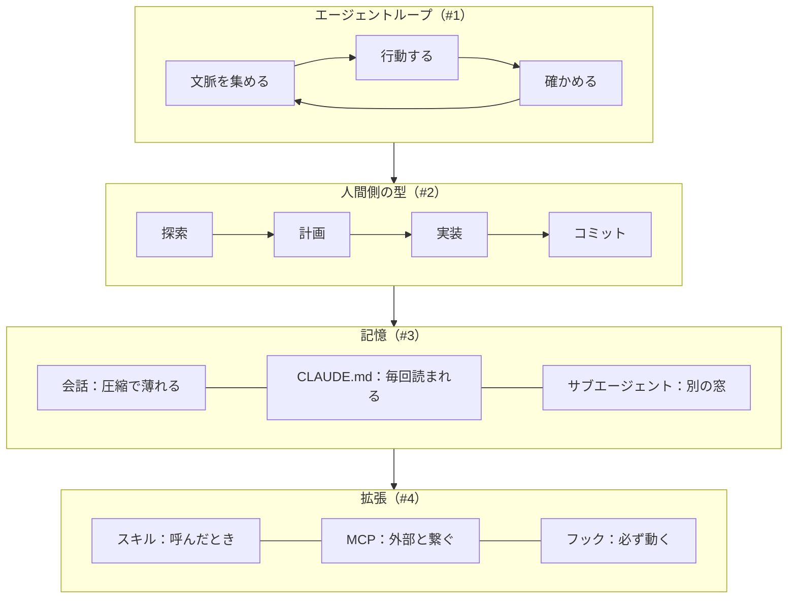

この記事は「Claude Code 101を日本語で」シリーズの第5回、最終回です。

Anthropic（アンソロピック／Claudeの開発元）の無料コース「Claude Code 101」を一から受講して、学んだことを日本語でまとめてきました。今回は修了クイズと、シリーズ全体の振り返りです。

:::message
コースの中身をそのまま翻訳する記事ではありません。クイズの問題文や選択肢は載せません。一次情報は[コース本体](https://anthropic.skilljar.com/claude-code-101)をあたってください。
:::

最終回は修了クイズと振り返り。5回分で何が手元に残ったかを1枚にまとめます。

## コースの全体像

| セクション | レッスン | この記事シリーズ |
| --- | --- | --- |
| What is Claude Code? | 何か / 仕組み | #1 |
| Installing | インストール / 最初のプロンプト | #1 |
| Daily Workflows | 探索→計画→実装→コミット / コンテキスト管理 / コードレビュー | #2 |
| Customizing | CLAUDE.md / サブエージェント | #3 |
| Customizing | スキル / MCP / フック | #4 |
| Quiz | 修了クイズ | #5 |

5セクションを記事5本で歩いた対応図。Customizingだけ2回に分けた

レッスンは12本、ほぼ全部が短いテキスト（スキルの回だけ動画）。1本3〜5分で読めるので、通しで読むだけなら1時間かかりません。手を動かしながらでも1日で終わります。

## 修了クイズ

セクション5はクイズ1本。全問正解で修了、証明書がプロフィールから取得できます。

結果は全問正解でした。問題そのものは書けないので、代わりに「学んでいる途中で自分がどこで迷い、どこで意外に思い、どこは自信があったか」を残しておきます。クイズの手応えは、ほぼこの3つに対応していました。

- **迷ったところ**：第1回の「モデル」と「Claude Code」の関係。「ここで言うモデルって Sonnet や Opus のこと？」と途中で確認したくらいで、「考える側（モデル）」と「手足（ハーネス）」の切り分けは、言葉で聞くと簡単なのに自分の口で説明しようとすると一度つまずきました
- **意外だったところ**：権限モード。コースは3つと言っているのに、手元の画面下には `auto mode on` と出ていて4つ目があった。「コースより製品が先に進んでいる」を最初に体感した場面で、以後ずっと公式ドキュメントを横に開く癖がつきました
- **自信があったところ**：エージェントループとコンテキストの圧縮。「モデルが返すのはテキストかツール呼び出しの2種類」「圧縮が起きると最初の細かい指示が薄れる」は、途中の理解チェックで自分の言葉で答えられていたので、クイズでも迷いませんでした

クイズを受けて感じたのは、各レッスンの末尾にある「Recap（まとめ）」がそのまま出題範囲だということ。逆に言えば、Recapを自分の言葉で言い直せるなら通ります。

Recapを読む→自分の言葉で言い直す→受ける、の3段。証明書のイメージ図で、実物の画面ではない

## 学習の進め方として良かったこと

### 読む前に「訳」を、読んだ後に「実験」を

英語のレッスンを読む前に日本語の要約を先に見て、読んだ後にターミナルで同じことを試す、という順番で進めました。「先に訳を見る」のはズルに思えますが、知らない概念を英語で初見するのと、日本語で一度聞いてから英語で読むのとでは、読む速度が3倍くらい違いました。

訳を先に、英語を読んで、ターミナルで試す。順番を変えただけで読む速度が変わる

### 実験は自分のリポジトリで

コースの例はNext.jsのアプリですが、実験は自分が普段触っているリポジトリでやりました。第2回の「画像の3MBチェック」は、実際に困っていた問題です。自分の困りごとを題材にすると、Planモードの計画が「本当に使える計画か」を自分で判定できます。

整った箱と、はみ出した自分の困りごと。計画の良し悪しは、困っている本人にしか測れない

### コースと製品のズレを楽しむ

シリーズを通して何度も「コースにはこう書いてあるが、手元の製品ではこうだった」が出てきました。

| コースの記述 | 手元の製品 |
| --- | --- |
| 権限モードは3つ | 4つ（Autoが追加） |
| MCPは全ツールを常駐させる | 必要時読み込みが既定で0トークン |
| フックのイベントは5つ | SessionStart / SessionEnd などが追加 |
| 記憶はCLAUDE.md | 自動メモリも併存 |

4つのズレはどれも製品側が先に進んでいた。迷ったらドキュメントを正とする

製品の進化がコースを追い越しているのは、この分野では普通のことです。ズレを見つけるたびに公式ドキュメントを開く癖がつくので、むしろ良い教材でした。**迷ったらドキュメントを正とする**。

## 5回分を1枚にまとめる

内側から順に、エージェントループ・人間側の型・記憶・拡張。コースはこの4層を外側から見せてくれる

一言で言えば、Claude Code は **「モデルの周りに、記憶と道具と安全装置を組んだハーネス」** で、コースはその部品を外側から順に見せてくれる構成でした。

## 研究者目線のメモ：このコースから授業に持っていくもの

自分は10月に、学生向けに「マルチエージェントでプロジェクトチームを構築する」という90分の授業を担当します。このコースから持っていく要素を3つに絞りました。

1. **役割分担はコンテキストの分離である**（#3）。プロンプトで役割を書き分けるだけでは足りない。別の窓で、要約だけを渡す設計にして初めて「新しい目」が生まれる
2. **お願いの層と強制の層を分ける**（#4）。守ってほしいことをプロンプトに書くのは「お願い」。絶対に起きてほしいことはフックのような仕組みに置く。失敗したとき、どちらの層の問題かを切り分ける
3. **計画は一番安い軌道修正**（#2）。コードを書く前に計画を出させて、成功の条件を人間が1行足す。学生にやらせる実習は、ここから始めるのが一番事故が少ない

90分授業に持っていく3つ。どれもコースの言葉ではなく、実験して腹落ちした言い方に直してある

## 次に受けるコース

Anthropic Academy（Claude Academy へ移行中）には続きのコースがあります。自分が進む順番はこうです。

1. **Introduction to subagents**。サブエージェントの専門コース。授業の芯になる
2. **Claude Code in Action**。CLAUDE.md・スキル・フックを使って、放置しても信頼できる長いセッションを作る
3. **Introduction to Model Context Protocol**。MCPサーバーを自分で作る

次の道しるべは3本。サブエージェント→長いセッション→MCPサーバーの順に進む

## 参考

- [Claude Code 101（Anthropic Academy）](https://anthropic.skilljar.com/claude-code-101)
- [Anthropic Courses 一覧](https://anthropic.skilljar.com/)
- [Claude Code Docs](https://code.claude.com/docs/en/overview)
